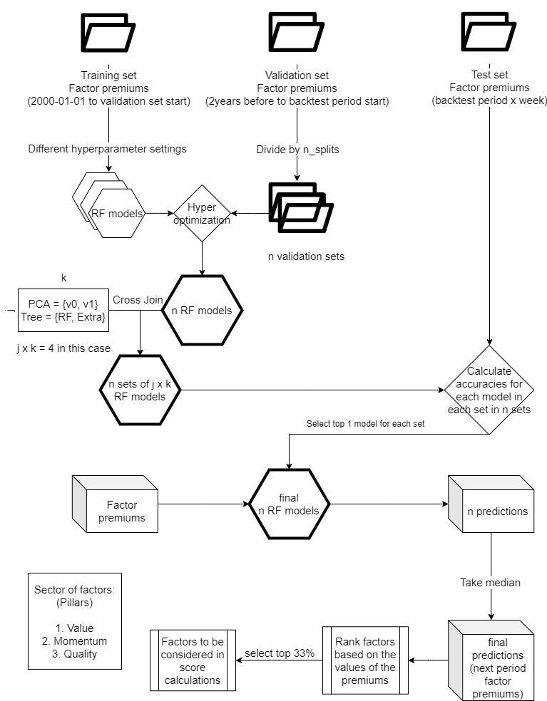

# AI Score Model
1. [Principle](#principle)
2. [Factor Model](#factor-model)
    1. [Contents](#contents)
    2. [How to Run](#how-to-run)
3. [AI Score Calculation](#ai-score-calculation)
4. [Database](#database)

# Principle

AI Score calculation consists of two major parts, factors selection and calculate the score based on the selected factors.

Formula of AI Score: AI Score = avg(Value Score + Quality Score + Momentum Score + Extra Score or ESG Score)

Where 

Value Score = avg(Best value factors), Best value factors = top 33% value factors predicted by random forest (factor model)

Quality Score = avg(Quality factor 1 score), Best quality factors = top 33% quality factors predicted by random forest (factor model)

Momentum Score = avg(Momentum factor 1 score), Best momentum factors = top 33% momentum factors predicted by random forest (factor model)

Extra Score = avg(Best factors), Best factors = all factors in factor_result_rank table where pred_z > 1 (which means the factor is exceptionally profiting)

*for each factor* pred_z value = (predicted premium - avg(all predicted premium))/std(all predicted premium)

See further on [confluence](https://loratechai.atlassian.net/wiki/spaces/SEAR/pages/880738405/AI+Score)

# Factor Model

This repository is the factor model reposition, which selects "good"/"bad" factors for each period on different horizons (1-week, 4-week, 8-week, 26-week).

## Contents
```
DSS-Quant-Factors/
┣ cron/
┃ ┣ LogFile/
┃ ┣ factor_monthly.sh
┃ ┗ factor_weekly.sh
┣ general/
┃ ┣ send_email.py
┃ ┣ send_slack.py
┃ ┣ sql_process.py
┃ ┗ utils.py
┣ images/
┃ ┗ factormodel.png
┣ preprocess/
┃ ┣ calculation_ratio.py
┃ ┣ calculation_premium.py
┃ ┣ model.py
┃ ┗ analysis_premium.py
┣ results_analysis/
┃ ┣ calculation_rank.py
┃ ┣ analysis_backtest_eval.py
┃ ┣ analysis_runtime_eval.py
┃ ┣ analysis_score_backtest.py
┃ ┣ analysis_score_backtest.py
┃ ┗ analysis_universe_rating_history.py
┣ .gitignore
┣ README.md
┣ global_vars.py
┣ main.py
┣ Makefile
┣ random_forest.py
┗ requirements.txt
```
All **[analysis_*.py]** files are for backtest only, therefore will be ignored in this documentation for simplicity.
- They are not directly related to the model struction / production.
- Limited documentation exists in each file. 

---

## **./**

### **global_vars.py**
Global variables define URL / Table names / logging.

### **main.py**
Main file for training, defining configuration used in the model training.

For detailed explanation of the prediction rational, please refer to [How to Run](#how-to-run).

### **random_forest.py**
Random/Extratree forest for train / runtime evaluation / prediction.

This script updated the following DB Tables:
1. `factor_model`: 
   - Record the configuration & overall evaluation results of each model.
2. `factor_model_stock`: 
   - Record predictions of each stock for the best Hyperopt trials selected. 

In analysis, the two tables can be merged with *uid*.

---
## **cron/**

### **LogFile/**
This folder contains *.log files for weekly / monthly training of models.
The training is currently scheduled on PC1 with the following cron jobs.
```
10 14 * * 0 /home/loratech/PycharmProjects/factors/cron/factor_monthly.sh 2>&1 > /home/loratech/PycharmProjects/factors/cron/factor_monthly.log 2>&1
10 13 * * 0 /home/loratech/PycharmProjects/factors/cron/factor_weekly.sh 2>&1 > /home/loratech/PycharmProjects/factors/cron/factor_weekly.log 2>&1
```
In [main.py](main.py), we add extra constrains for the starting time of above jobs. 
1. Monthly training will only start on the first Sunday of each month.
2. Monthly training will only start after weekly training finished. 
3. Weekly training will only start after weekly ingestion of Worldscope/IBES/Macros Data finished. 

### **factor_monthly.sh**
For monthly training schedule. 

### **factor_weekly.sh**
For weekly training schedule.

---
## **general/**

### **send_email.py**
Send emails from [asklora@loratechai.com](asklora@loratechai.com).

### **send_slack.py**
Send message / pd.Series / pd.DataFrames / Files to slack. 
Factor model slack channel: [#dss-quant-factors-message](#dss-quant-factors-message).

### **sql_process.py**
For read / write to SQL DB. Refer to [global_vars.py](global_vars.py) for db_url_read / db_url_write. 
Production should set both as ALIBABA Prod DB URL.

### **utils.py**
Other general utility functions (e.g. save to excel).

---
## **images/**

### **factormodel.png**
Flowchart for training process for [README.md](README.md).

---
## **preprocess/**
Preprocessing raw data ingested to expected format for training / prediction.

### **calculation_ratio.py**
Using raw data ingestion to calculate weekly factor ratios of each ticker and write to Table `factor_processed_ratio`. 
Full list of factors calculated can refer to Table `factor_formula_ratios_prod`.

Ratio table will be updated weekly before training for recent 3-month ratios. 

### **calculation_premium.py**
Using factor ratios calculated with [preprocess/calculation_ratio.py](calculation_ratio.py) to calculate premiums in each group (currency_code / indsutry_code) and write to `factor_processed_premium`.

Premium table will be updated weekly before training for *entire* history (i.e. to adjust for different active universe).

### **load_data.py**
Prepare training / testing sets with premium calculated with [preprocess/calculation_premium.py](calculation_premium.py) and macro/index ratios, including:
1. separate training / testing samples based on defined testing periods & weeks_to_expire (i.e. return periods used in premium calculation).
2. (optional) add *T-n premiums* + *average of (T-a, T-b) premiums* as X
3. (optional) apply PCA to X for dimension reduction
4. (optional) use qcut mean instead of actual premium as model prediction y.
5. split training / validation sets 

#### Data Preparation

- Model input are factor premiums of the factors in one pillar, defined in this [page](https://loratechai.atlassian.net/wiki/spaces/SEAR/pages/858685974/Story+2021-08-20)
- Recap: 4 pillars = Value, Quality, Momentum, Extra
- Output are the factor premiums of the next period.
- Test data set are the factor premiums in backtest period x week before today
- Validation data set are the factor premiums in 2 years before the test set
- Training data set are all the factor premiums before the validation set

### **model_log.py**
Record logs to `factor_model_log` for different training configurations.

---
## **results_analysis/**

### **calculation_rank.py**
Convert predictions recorded during training in `factor_model_stock` to ranking for AI Score calculation.

This script updated the following DB Tables:
1. `factor_result_rank_backtest_eval`: 
   - Record evaluation metrics / factor selection for each configuration
   - This table is also used to select best config for rank calculation.
2. `factor_result_rank_backtest`: 
   - Best config rank entire history for current training 
3. `factor_result_rank`: 
   - Current rank for AI Score calculation (i.e. most recent period) 
4. `factor_result_rank_history`: 
   - Record history of rank used for AI Score calculation.

#### Rank Calculation
- We select factors with top 1/3 predictions as "good"/"max" factors; bottom 1/3 as "bad"/"min factors. 
- Best config is determined based on testing period cumulative returns. 
- Config to be selected are hyperparameters of entire model that was not selected Grid Search instead of Hyperopt, e.g.
  - *PCA ratios*
  - *Tree type*: Random Forest / ExtraTree Forest
  - *Validation Method*

---

## How to Run

### Flowchart

The flowchart of dactor selection and ranking process is as:



### Training
use `python3 main.py --option *sth*` to train and test model by a signal script.

#### Parser
| Option | Explanation | Input |
|--------|-------------|------------|
| recalc_premium | recalculate stock premiums | None |
| recalc_ratio | recalculate stock to vector ratios | None |
| weeks_to_expire | how many weeks for this prediction to expire | n (int) |
| processes | create how many parallel process (multiprocessing) to run the script | n (int) |
| backtest_period | use how many weeks as test dataset | n (int) |
| trim | trim outliers (top & bottom 5% of each dataset) | True/False |
| debug | run script in dev mode (will not affect prod database) | True/False |

The scheduled training used options can refer to [Makefile](Makefile).

#### Schedule for Production
In production (i.e. run main.py without --debug) will cause the script to wait until all following requirements are met:

For weekly training:
- Weekly training will only start after weekly ingestion of Worldscope / IBES / Macroeconomics data finished. 

For monthly training:
- only start on the first Sunday of each month; 
- only start after weekly training finished. 

#### Rerun Write Premium
Update ratio / premium tables if `--recalc_ratio` & `--recalc_premium`.

#### Different Configs
Defined configs to be selected as **hyperparameters** of entire model with Grid Search instead of Hyperopt (only select RF trees hyperparams), e.g.
- *PCA ratios*
- *Tree type*: Random Forest / ExtraTree Forest
- *Validation Method* (i.e. n_splits)

Define **y_type** of the training, i.e. what factors (n>1) to predict.
- The detailed list of factors in each y type can refer to `factor_formula_y_type`.

Define **testing_period** of the training based on 
- Based on available trading days in `factor_processed_premium` given specific `--weeks_to_expire *n*` & `--average_days *n*`.
- Testing on the most recent n periods (n=`--backtest_period *n*`)

#### Model Training
Train model of different configs with multiprocessing (n=`--processes *n*`).
Start [random_forest.py](#-randomforestpy) for each config.

#### Results Analysis


Tree models are not saved as time required for the whole process is short (depends on settings, at most few hours)


---
# AI Score Calculation
### *ingestion repository*

[DSS-Quant-Ingestion](https://github.com/asklora/DSS-Quant-Ingestion) updates the ai_score of each ticker based on the current factor settings (prediction results given by the factor model)

Use the script `ingestion/universe_rating.py` to update AI Score in: 

1. `universe_rating`: 
   - current displayed ai_score / ai_score2 (i.e. +ESG Score; -Extra Score)
2. `universe_rating_history`: 
   - AI score history for each period (1w/4w...) and type (value/quality/momentum/extra/esg/dlpa) scores.
3. `universe_rating_detail_history`: 
   - factor scores used for ai_score calculation

AI Score is updated twice a day in the end of daily ingestion of price for North Asia / Western Market.

Additional update on Monday morning 6:30am HKT to reflect changed in Factor Ranking / DLPA Scores.

---
# Database
In ALIBABA DB Prod, all **[factor_*]** Tables will be updated with scripts in this repository. 

Including:
1. `factor_model_log`:
   - Logs for different model training config / updates.
2. `factor_formula_ratios_prod`:
   - Factors calculation formula for ratio calculation.
3. `factor_formula_y_type`:
   - Map y_type names to list of factor. 
4. `factor_processed_ratio`:
   - Weekly factor ratios calculated for each ticker.
5. `factor_processed_premium`:
   - Premiums calculated for each group based on ratios. 
6. `factor_model`: 
   - Record the configuration & overall evaluation results of each model.
7. `factor_model_stock`: 
   - Record predictions of each stock for the best Hyperopt trials selected.
8. `factor_result_rank_backtest_eval`: 
   - Record evaluation metrics / factor selection for each configuration
   - This table is also used to select best config for rank calculation.
9. `factor_result_rank_backtest`: 
   - Best config rank entire history for current training 
10. `factor_result_rank`: 
    - Current rank for AI Score calculation (i.e. most recent period) 
11. `factor_result_rank_history`: 
    - Record history of rank used for AI Score calculation.
